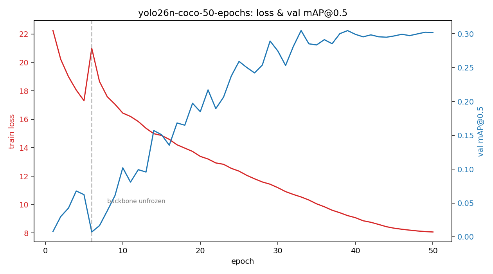

# yolo26n-coco-50-epochs

COCO-pretrained YOLO26n, fine-tuned on LOCO for 50 epochs (backbone frozen
until epoch 6, then unfrozen). Source: `colab_runner.sh` train + eval logs,
pasted into chat on 2026-08-14 (Colab runtime disconnected before
`generate_report.py` could be run against the live checkpoint, so this
report was assembled from the raw log text rather than re-running eval.py —
**no prediction images included**, see caveat below).

## Eval metrics (via eval.py, held-out subset 1/4)

- **mAP@0.5:** 0.1120
- **parameters:** 2,505,750 (2.51 M)
- **GFLOPs per image:** 5.749
- **median batch-1 latency:** 17.01 ms (cuda, machine-dependent, not graded)
- **checkpoint used:** `best.pt`, saved at epoch 33/50 (highest val_mAP50 seen during training: 0.3048)

## Training curves

Notable: backbone was unfrozen at epoch 6, causing a sharp mAP collapse
(0.0623 -> 0.0071) that took ~4 epochs to recover past its pre-unfreeze
level. Loss declines steadily and monotonically through epoch 50 with no
plateau -- training was very likely still improving when it was cut off.

## Known issues / why the eval number is low

- **0.1120 (held-out eval) vs 0.3048 (best in-training val) is a real gap**,
  not a typo -- different subsets, and the eval subset is presumably harder
  or differently distributed. Needs investigation before trusting either
  number as "the" result.
- LOCO class imbalance/skew is suspected as a major driver (see
  Tadjine et al. 2025 split-fix paper).
- COCO-pretrained head is being fully retrained on 5 LOCO classes from
  scratch-ish weights rather than transferred -- head-weight-transfer
  approach (Kuen et al. ICCV 2019 / arXiv:1912.06185) not yet tried.
- No dataset leak check done yet (test/train hash dedup) -- planned via
  Roboflow re-split, not yet executed.

## Next planned runs

| run | branch | mAP@0.5 | notes |
|---|---|---|---|
| yolo26n-coco-50-epochs | yolo26s-coco | 0.112 (eval) / 0.305 (best train-val, epoch 33) | baseline, this report |
| _(pending)_ | | | +150 epochs, same setup, as a control |
| _(pending)_ | | | head-weight-transfer variant (Kuen et al. / arXiv:1912.06185) |
| _(pending)_ | | | RCNN baseline per Malek's class, target 0.70 mAP@0.5 |
